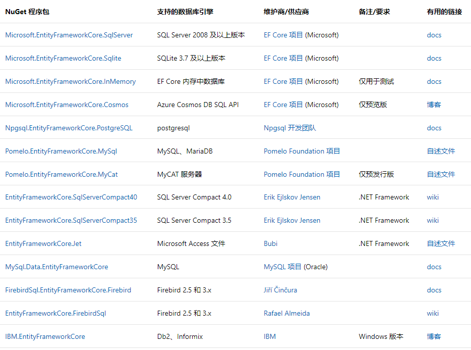
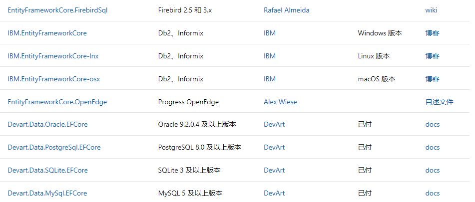
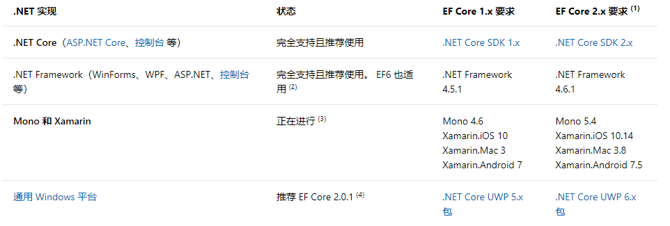

###		EntityFrameworkCore介绍

####		EntityFramework Core是轻量级、可扩展、开源的跨平台的数据库访问技术，可用作对象关系映射（ORM)服务，使.NET开发人员能够使用.NET对象来处理数据库，避免编写大部分数据库访问代码，简称EF Core。

######		一、EF Core目前已能支持多个数据库引擎，包括：Sqlserver、Sqlite、Mysql、MariaDB、PostgreSql、DB2、Firebird等，未来还即将支持：Oracle、Cosmos DB，官方提供的说明如下：

######	二、 EF Core  是个.NetStandard 2.0库，EF Core 需要支持运行 .NET Standard 2.0 的实现， 其他 .NET Standard 2.0 库也可引用 EF Core。官方提供的EF Core 实现支持如下图：

从图中可以看出，EF Core对.NetCore和.NetFramework 4.5.1和4.6.1能完全支持。

######		三、EFCore安装

有三种方式进行EF Core安装：.NET Core CLI命令、Nuget包管理器对话框、Nuget包管理器控制台。在安装EF Core之前，需要确保已经安装EF Core相对应版本的SDK包，比如：NET Core SKD,.NET Farnework等。

1、.Net Core CLI命令：

 dotnet add package Microsoft.EntityFrameworkCore.SqlServer

2、Nuget包管理器对话框：

从 Visual Studio 菜单中选择“项目”>“管理 NuGet 包”，输入相应的数据库提供程序包，如：Microsoft.EntityFrameworkCore.SqlServer

3、Nuget包管理器控制台：

从 Visual Studio 菜单中选择“工具”>“NuGet 包管理器”>“包管理器控制台”，输入相应的数据库提供程序包，如：

Install-Package Microsoft.EntityFrameworkCore.SqlServer

若要更新提供程序，使用 `Update-Package` 命令，还可以使用 -version  指定对应的包版本